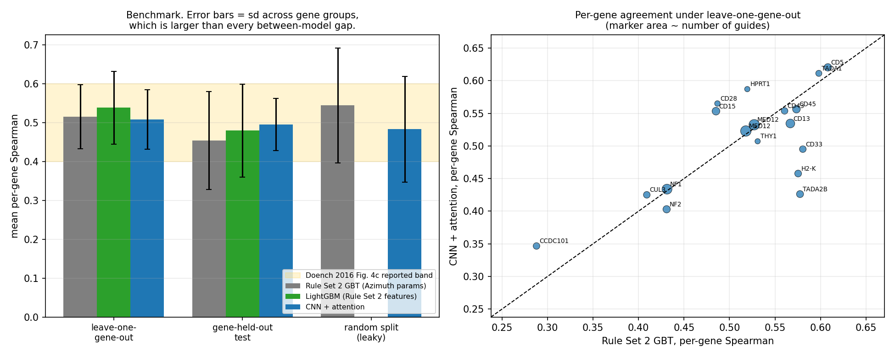
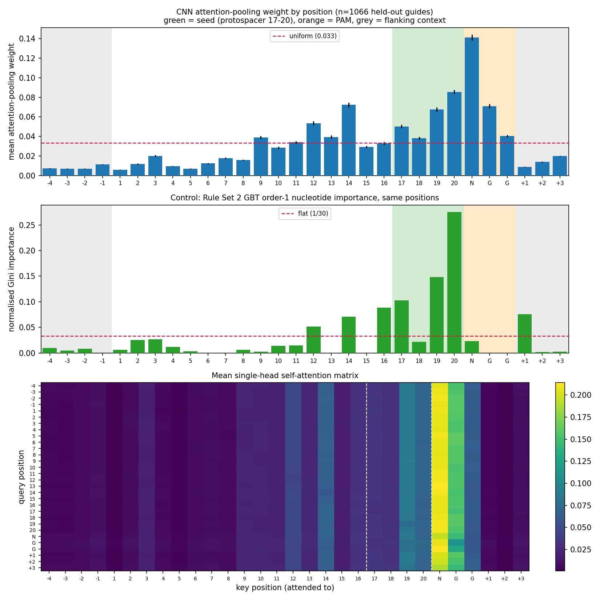
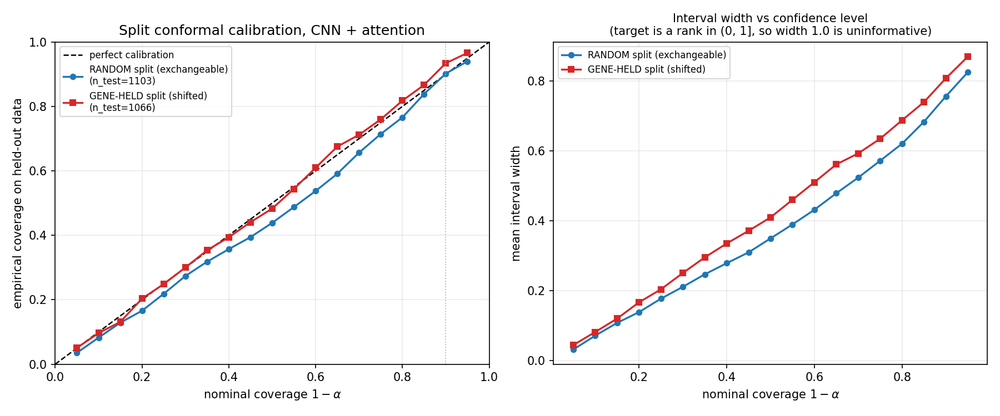

# CRISPR On-Target Efficiency Prediction

A CNN + attention model for sgRNA on-target editing efficiency, benchmarked against a
reproduced Rule Set 2 gradient-boosted-tree baseline, with attention-based
interpretability and conformal prediction intervals.

**Headline result.** The Rule Set 2 baseline reproduces at **0.515 +/- 0.082** mean
per-gene Spearman under leave-one-gene-out, inside the band Doench et al. report. The
CNN + attention model **ties** it (0.507, paired Wilcoxon p = 0.77) and beats it on the
frozen gene-held-out test set (0.495 vs 0.454), but does not beat a tuned LightGBM on
the same hand-crafted features. Conformal intervals are well calibrated (90.2% empirical
at 90% nominal). Attention concentrates on the PAM-proximal seed region as the biology
predicts, and a gradient-boosted-tree importance control independently agrees.

---

## Quick start

The trained model and all results are committed, so no retraining is needed.

**Just look at the results.** Open `dashboard/index.html` in any browser. Eight sections, including a guide
scorer that runs the trained network in your browser.

**Run the interactive version.**

```bash
python3 -m venv .venv && .venv/bin/pip install -r requirements.txt
.venv/bin/streamlit run dashboard/app.py
```

**Re-verify the claims.** Reproduces every reported number from the committed
out-of-fold predictions and runs 39 adversarial checks in about 9 seconds.

```bash
bash scripts/fetch_azimuth.sh          # downloads the source data (~4 MB)
.venv/bin/python scripts/01_build_dataset.py
.venv/bin/python scripts/08_validate.py
```

Full retraining is in section 9. It takes roughly 1.5 hours on CPU and is not needed for
anything above.

| Where to look | What is there |
|---|---|
| `dashboard/index.html` | Self-contained results dashboard with a live guide scorer |
| `crispr/` | Library: data, features, models, conformal, scoring |
| `scripts/` | One script per phase, each printing its own findings |
| `artifacts/*.json` | Every reported number, machine-readable |
| Section 2 | Benchmark table and significance testing |
| Section 7 | The 39 validation checks and what they defend against |

---

## 1. Data

**Source.** Doench et al. 2016, *Optimized sgRNA design to maximize activity and minimize
off-target effects of CRISPR-Cas9*, Nature Biotechnology 34:184, via the authors'
[Azimuth repository](https://github.com/MicrosoftResearch/Azimuth). This is the original
Rule Set 2 codebase and ships the training data.

**What the dataset actually is.** The file `azimuth/data/FC_plus_RES_withPredictions.csv`
is the merged V1 + V2 table that Azimuth's `load_data.mergeV1_V2` writes out, the
combined dataset Rule Set 2 was trained on.

| | |
|---|---|
| Rows (guide x drug observations) | 5,310 |
| Unique 30mer sequences | 4,379 |
| Genes | 17 |
| FC half (Doench 2014 flow cytometry) | 1,837 rows, 9 genes |
| RES half (Doench 2016 resistance screens) | 3,473 rows, 8 genes |
| Target | `score_drug_gene_rank` in (0, 1], higher = more active |

The target is the measured activity **rank-transformed within each (gene, drug) group**
and scaled to the unit interval. That grouping is why every metric below is computed
per gene group rather than pooled. Pooling measures something different and reads
higher.

**Sequence layout.** Each 30mer is 4nt of 5' context + the 20nt protospacer + the 3nt
NGG PAM + 3nt of 3' context. Verified: all 5,310 sequences are exactly 30nt over the
ACGT alphabet with `GG` at 0-indexed positions 25-26.

**Verification, not assumption.** `crispr/data.py` re-derives the target from the raw
`V1_data.xlsx` and `V2_data.xlsx` files by porting Azimuth's Python 2 rank-transform
logic, and compares it to the shipped CSV. Maximum absolute difference: **5e-10**
across all 5,310 rows. The CSV is the real thing.

**One trap worth flagging.** The CSV also ships a `predictions` column. Scoring it gives
Spearman **0.694**, far above anything in the paper. That column is the released V3 model
predicting its own training data. It is an in-sample ceiling, not a benchmark, and is
reported in the table below only labelled as such.

### Split strategy

Three protocols, because the choice changes the answer by more than the choice of model
does.

| Protocol | What it is | Why |
|---|---|---|
| **Leave-one-gene-out** (primary) | 17 folds, one gene held out each time | Azimuth's own default (`learn_options['cv'] = 'gene'`) and how Doench 2016 Fig. 4 reports Spearman. The paper-comparable number. |
| **Frozen gene-held-out** | whole genes into 60% train / 20% calibration / 20% test | A single fixed split, needed for conformal (which requires a disjoint calibration set) and for saving one inspectable model. Genes: train = CD43, H2-K, HPRT1, MED12, NF1, NF2; cal = CCDC101, CD13, CD33, CD5, THY1; test = CD15, CD28, CD45, CUL3, TADA1, TADA2B. |
| **Random row-level** | 20% of rows at random | Reported **only as a leakage contrast**. Guides tiling one gene share sequence context and the target is ranked within gene, so a random split leaks. It inflates the GBT from 0.454 to 0.544. |

Gene sizes are very uneven (MED12 alone is 35% of all rows), so genes are assigned
largest-first to whichever split is furthest below its row quota, rather than at random.
A naive random gene assignment produces unusable proportions.

---

## 2. Benchmark

Mean per-gene Spearman correlation; +/- is the standard deviation across gene groups, which
is how the paper draws its error bars.

| Protocol | Model | Spearman | sd | pooled |
|---|---|---|---|---|
| **leave-one-gene-out** | Rule Set 2 GBT (Azimuth hyperparameters) | 0.5148 | 0.082 | 0.4969 |
| | LightGBM (same features) | **0.5378** | 0.093 | 0.5161 |
| | CNN + attention | 0.5073 | 0.077 | 0.4865 |
| **gene-held-out test** | Rule Set 2 GBT | 0.4535 | 0.125 | 0.4474 |
| | LightGBM | 0.4790 | 0.119 | 0.4749 |
| | CNN + attention | **0.4950** | 0.067 | 0.4715 |
| *random split (leaky)* | Rule Set 2 GBT | *0.5437* | 0.147 | 0.5718 |
| | CNN + attention | *0.4829* | 0.136 | 0.4917 |
| *in-sample reference* | Azimuth released model, shipped predictions | *0.6938* | 0.061 | 0.7148 |



### Baseline checkpoint against the literature

The spec called for stopping if the baseline fell outside the published range. It did not.

Doench 2016 reports the leave-one-gene-out Spearman for boosted regression trees
**graphically** in Figure 4c, not as a number in the text, with visible spread across
genes. The reproduction lands at **0.515 +/- 0.082**, inside that band. Nothing was
hardcoded to hit it: the baseline uses Azimuth's exact hyperparameters
(`GradientBoostingRegressor`, squared-error loss, lr 0.1, 100 trees, depth 3, no
subsampling), read out of `models/ensembles.py`, on a feature set reproduced from
`features/featurization.py`.

### Are the differences real?

With 18 evaluation groups and a spread of ~0.08 across them, small gaps in mean Spearman
are not meaningful. Every pair was compared paired across gene groups, with a bootstrap
interval on the mean difference:

| Comparison (leave-one-gene-out) | Mean diff | 95% CI | Wilcoxon p | Verdict |
|---|---|---|---|---|
| CNN - Rule Set 2 GBT | -0.0075 | [-0.036, +0.019] | 0.77 | tie |
| CNN - LightGBM | -0.0305 | [-0.063, +0.004] | 0.067 | tie |
| LightGBM - Rule Set 2 GBT | +0.0230 | [-0.007, +0.047] | 0.006 | small but consistent edge to LightGBM |

The last row is the one place the two tests disagree, and the disagreement is
informative rather than a problem: the Wilcoxon says LightGBM wins on *most individual
genes* (consistent sign), while the bootstrap CI on the *mean* includes zero (small
effect size). LightGBM is reliably a little better, not decisively better.

**So: does the CNN match or beat the baseline?** Against the reproduced Rule Set 2
model, yes: it ties under the paper protocol and wins on the frozen test set. Against a
modern GBT on the same features, no. On ~4k guides, a learned sequence representation
buys nothing over well-chosen k-mer features. That is the honest finding and it is
consistent with why Rule Set 2 has held up as a baseline for a decade.

---

## 3. Architecture

```
(30, 4) one-hot 30mer
  -> Conv1d k=3, 64 filters  -> BatchNorm -> ReLU -> Dropout1d(0.35)
  -> Conv1d k=5, 128 filters -> BatchNorm -> ReLU -> Dropout1d(0.35)
  -> + learned positional embedding
  -> single-head self-attention over the 30 positions   |  weights from both
  -> attention-weighted pooling over positions          |  kept for interpretability
  -> concat with 10-dim thermodynamic / gene-position vector
  -> Dense 64 -> 16 -> 1, dropout 0.3, sigmoid
```

Sigmoid rather than linear because the target is a rank in (0, 1].

**Two deviations from the original spec, both forced by measurement.**

1. **A learned positional embedding was added.** Convolutions are translation-equivariant,
   so without one the network genuinely cannot tell position 4 from position 20, yet
   Rule Set 2 draws 58% of its Gini importance from *position-specific* nucleotide
   identity. This was the clearest structural gap, worth +0.010 on the selection CV.
2. **`Dropout1d` in the conv stack.** The literal spec architecture reached 0.99 training
   Spearman against 0.21 held-out. Feature-map dropout was the single most effective fix
   (+0.055 on the selection CV).

**Thermodynamic features** (GC count of the protospacer, melting temperature of the full
30mer and of Azimuth's three sub-segments, percent peptide, amino-acid cut position) enter
at the fusion step, not through the conv stack. Removing the gene-position features was
tried and made things substantially worse (0.377 down to 0.179), so they were kept.

### Selection methodology

Twenty configurations were compared. To keep the reported test numbers honest,
**selection used leave-one-gene-out restricted to the six training genes only**. The
test and calibration genes were never loaded during the sweep
(`scripts/03a_sweep_cnn.py`, `scripts/03b_sweep_round2.py`).

One caution about reading those sweep numbers: the inner protocol trains on 5 genes
instead of 16, so everything scores lower there. The GBT was re-measured on the *same*
inner protocol (0.505, not its 0.515 leave-one-gene-out figure) to establish the correct
bar, which is why the CNN's 0.392 inner-CV score did not lead to abandoning the model.
It reached 0.507 once given the full protocol.

Each reported fold is an ensemble of 3 seeds, each with its own inner validation gene
subset, with early stopping on validation Spearman.

---

## 4. Interpretability



Attention-pooling weights from the gene-held-out ensemble, averaged over 1,066 held-out
guides:

| Region | Mean weight | vs uniform (1/30) |
|---|---|---|
| PAM (NGG) | 0.0842 | **2.53x** |
| Seed, protospacer 17-20 | 0.0604 | **1.81x** |
| Rest of protospacer, 1-16 | 0.0269 | 0.81x |
| 5' context (-4 to -1) | 0.0083 | 0.25x |
| 3' context (+1 to +3) | 0.0142 | 0.43x |

Seed vs rest-of-protospacer, paired across guides: Wilcoxon p ~ 3e-123.

The seed-region prior holds. Weight rises monotonically along the protospacer toward the
PAM and peaks at the PAM's variable N base, which is consistent with Cas9 requiring PAM
recognition before it interrogates the protospacer, and with seed-proximal mismatches
being the most disruptive.

**Independent control.** Attention weights are easy to over-read, so the same question was
put to the GBT, which needs no attention mechanism to be interpretable. Aggregating its
order-1 nucleotide Gini importance by position puts **54.8%** of positional importance in
the four seed positions, against 13.3% if it were flat. Two methods with nothing in common
agree on where the signal is, which is much stronger evidence than either alone.

---

## 5. Conformal prediction



Split conformal with absolute-residual nonconformity scores and the finite-sample
quantile correction ceil((n+1)(1-alpha))/n, calibrated on a held-out set disjoint from both
training and test.

| Split | n_cal | n_test | Coverage at 90% nominal | Half-width | Mean abs gap, all levels |
|---|---|---|---|---|---|
| Random (exchangeable) | 1,016 | 1,103 | **90.2%** | +/-0.378 | 0.035 |
| Gene-held-out (shifted) | 1,059 | 1,066 | 93.4% | +/-0.404 | 0.011 |

Both were run deliberately. Conformal's guarantee requires calibration and test data to
be **exchangeable**. Under the random split they are, and coverage tracks nominal almost
exactly, which validates the implementation. Under the gene-held-out split the
calibration genes and test genes are disjoint, so the guarantee does not formally hold;
empirically it comes out *conservative* (93.4% at nominal 90%) with wider intervals,
which is the safe direction but is luck rather than a theorem.

The honest caveat is about usefulness, not correctness: a +/-0.38 interval on a target
bounded in (0, 1] is wide. These intervals are informative for flagging which predictions
not to trust, not for fine-grained ranking of individual guides.

---

## 6. Chromatin channel: cut, with evidence

The spec required cutting this phase rather than proceeding on a guessed ENCODE
accession. `scripts/04_chromatin_feasibility.py` queries the ENCODE portal live and
records the result. Three independent blockers, any one of which is sufficient:

1. **The main cell line has no accessibility data.** The RES half, 65% of all rows, was
   screened in A375 melanoma. A375 has **zero** ATAC-seq or DNase-seq experiments on
   ENCODE; its only ENCODE data is RNA-based (small RNA-seq, total RNA-seq, RAMPAGE).
2. **There is no single cell line to match.** The remaining 35% comes from NB4, TF1 and
   MOLM-13 plus mouse cell lines. TF1 has no ENCODE data at all. Matching per-row would
   need several tracks across two genomes.
3. **There are no genomic coordinates to look anything up with.** The Azimuth release
   carries only Ensembl transcript IDs and transcript-relative cut positions, with no
   chromosome and no genomic start/end. Querying a bigWig would require a separate
   transcript-to-genome mapping step first.

Substituting a track from a different cell line would silently inject the wrong biology
into the majority of the training data. The phase is cut, not deferred.

---

## 7. Validation

`scripts/08_validate.py` runs 39 adversarial checks, written so that each would
actually fail if the corresponding bug were present. All 39 pass. The ones that carry
real weight:

| Check | Result |
|---|---|
| **Label-shuffle negative control.** Shuffle the target within each gene group and retrain. Any leakage in the split or features would still score above zero. | shuffled **+0.008** vs real **+0.454** |
| **Independent agreement with the released Azimuth model.** Our reproduced features + Azimuth's hyperparameters, fit in-sample, vs the shipped predictions. A weak match would mean the feature reproduction is wrong. | Spearman **0.966**; our in-sample ceiling 0.713 vs their 0.715 |
| **Sequence leakage across the reported splits.** | gene-held-out: **0 shared 30mers** between train/cal/test |
| **Conformal on synthetic exchangeable data**, where the right answer is known. | nominal 0.95/0.90/0.80 gives empirical 0.950/0.899/0.805 |
| **Row accounting against the paper.** | RES unique guides = **2,549**, exactly as published; FC = 1,837 vs 1,841 (Azimuth's gene-position join drops a few, per its own comment) |
| **Headline numbers recomputed** from saved predictions, independently of the phase scripts. | reproduce to 1e-9 |
| **Feature unit tests** on a hand-checkable probe sequence: GC count, NGGX one-hot, k-mer counts, one-hot, matrix width. | all exact |

Two genuine findings came out of this, neither of which changes a conclusion:

**The random split leaks duplicate sequences, not just gene context.** 230 test rows share
a 30mer with a training row (MED12 was screened under two drugs, so many guides appear
twice). This is a second, independent leakage mechanism on top of the gene-level one, and
it reinforces why that split is reported only as a contrast. It does not affect the
conformal result: re-running coverage on only the test rows whose sequence the model never
saw gives **89.2%** at 90% nominal, against 90.2% on all rows.

**Melting temperature on short segments is not physically meaningful.** Rule Set 2 computes
Tm on 5nt, 8nt and 5nt sub-segments, which is below the range where nearest-neighbour
thermodynamics is valid; the 5-mer values come out negative (-69 to +1 degC). This is
inherited from the original design, not introduced here; Azimuth computes Tm on exactly
these segments. The values still function as deterministic sequence summaries, which is
how the model uses them, but they should not be read as temperatures.

```bash
.venv/bin/python scripts/08_validate.py     # ~9s, exits non-zero on any failure
```

---

## 8. Dashboards

Two views of the same numbers, both reading the payload written by
`scripts/09_export_dashboard.py` so they cannot drift apart.

**Static.** `dashboard/index.html`, a single 2.9 MB file with no external requests. Opens
from `file://`, hosts on GitHub Pages unchanged. Eight sections: benchmark, live scorer,
guide explorer, attention, calibration, architecture selection, validation, data.

**Streamlit.** `dashboard/app.py`, the same eight sections with Plotly charts, for local
exploration.

```bash
.venv/bin/python scripts/09_export_dashboard.py        # payload + weights (~2s)
.venv/bin/python scripts/10_build_static_dashboard.py  # verify + build (~7s)
.venv/bin/streamlit run dashboard/app.py               # interactive version
```

To publish the static one: Settings > Pages > deploy from branch `main`, folder `/ (root)`.
Pages only serves from the root or `/docs`, so the dashboard lands at
`<pages-url>/dashboard/` rather than the bare domain. No build step is needed on the
hosting side.

### Scoring a guide

Both dashboards score arbitrary 30mers with the **gene-held-out ensemble**, the same
three-seed model behind the reported 0.495 test number rather than an in-sample refit,
and wrap the prediction in a conformal interval calibrated on held-out genes.

One constraint is worth stating plainly: the model's thermodynamic block includes three
gene-position features (percent peptide, amino-acid cut position, and the <50% indicator)
that a bare 30mer cannot supply. The sweep measured what removing them costs (0.377 down to
0.179 inner-CV Spearman), so they are load-bearing rather than decorative. Both dashboards
default them to the training median and let you set them explicitly, which makes a pasted
sequence *sequence-conditional at an average locus* rather than silently wrong.

### The browser runs the real model

The static page has no server, so `dashboard/static/infer.js` is a hand port of
`CrisprCNN.forward` plus the feature extraction: convolutions, batch norm at eval,
positional embedding, self-attention, attention pooling, and the fusion head, over weights
inlined as base64 float32.

Porting the melting temperature needed an argument rather than a transcription. Azimuth
calls Biopython's `Tm_NN` with `DNA_NN2` against a perfect complement; in that special
case the mismatch and dangling-end branches are unreachable and every composition-dependent
initiation term in `DNA_NN2` is zero, so the whole calculation collapses to a 16-entry
dinucleotide sum. `scripts/09_export_dashboard.py` asserts each of those conditions against
the live Biopython tables instead of taking them on faith.

A silent numerical drift in the port would be invisible in the UI while making every
prediction on the page wrong, so `scripts/10_build_static_dashboard.py` scores 150 real
guides through Node and aborts the build if it disagrees with PyTorch by more than 1e-5:

```
thermodynamic block   max |JS - Biopython| = 0.00e+00
prediction            max |JS - PyTorch|   = 4.59e-08
attention weights     max |JS - PyTorch|   = 8.34e-08
```

The prediction and attention residuals are float32 round-off; the thermodynamics are exact.

---

## 9. Reproducing

```bash
python3 -m venv .venv && .venv/bin/pip install -r requirements.txt
bash scripts/fetch_azimuth.sh

.venv/bin/python scripts/00_inspect_source.py          # source audit
.venv/bin/python scripts/01_build_dataset.py           # features + splits (~5s)
.venv/bin/python scripts/02_baseline.py                # GBT baseline (~2 min)
.venv/bin/python scripts/03a_sweep_cnn.py              # selection, round 1 (~25 min)
.venv/bin/python scripts/03b_sweep_round2.py           # selection, round 2 (~25 min)
.venv/bin/python scripts/03_cnn.py --seeds 3           # CNN train + eval (~33 min, CPU)
.venv/bin/python scripts/04_chromatin_feasibility.py   # ENCODE check (needs network)
.venv/bin/python scripts/05_interpretability.py        # attention figure
.venv/bin/python scripts/06_conformal.py               # calibration figure
.venv/bin/python scripts/07_benchmark.py               # benchmark table + significance
.venv/bin/python scripts/08_validate.py                # 39 validation checks (~9s)
.venv/bin/python scripts/09_export_dashboard.py        # dashboard payload (~2s)
.venv/bin/python scripts/10_build_static_dashboard.py  # static build (~7s, needs node)
```

Skip the two sweep steps to reuse the stored selection in `artifacts/cnn_sweep.json`.

### Layout

```
crispr/
  data.py        dataset loading, independent re-derivation from Excel, split strategies
  features.py    Rule Set 2 feature reproduction, one-hot and thermodynamic encoders
  baseline.py    GBT baselines (Azimuth-exact and LightGBM)
  model.py       CNN + attention, training loop, standardizer
  conformal.py   split conformal, marginal and group-conditional
  evaluate.py    per-gene Spearman metrics
  scoring.py     single-guide inference + conformal interval, shared by the dashboards
scripts/         one script per phase, each printing its own findings
artifacts/       datasets, predictions, fitted model, JSON results
figures/         benchmark.png, attention_by_position.png, calibration.png
dashboard/
  app.py         Streamlit dashboard
  index.html     built static dashboard (single self-contained file)
  data/          exported payload + model weights
  static/        css, inline-SVG charts, browser inference port, page template
```

---

## 10. Known limitations

- **~4,400 unique guides is small.** It is the main reason the learned representation
  does not beat hand-crafted k-mer features, and the reason the architecture needed heavy
  regularisation.
- **17 genes means noisy evaluation.** The standard deviation across gene groups (~0.08)
  exceeds every between-model difference measured here.
- **MED12 is 35% of the data** and appears under two drugs. Gene-held-out splitting
  handles this correctly; random splitting does not, which is part of why the random-split
  numbers are inflated.
- **Melting temperature is not bit-identical to Azimuth's.** Biopython removed
  `Tm_staluc` in 1.77; `Tm_NN` with the `DNA_NN2` (SantaLucia 1998) table is used instead.
  Same nearest-neighbour parameters, slightly different salt-correction defaults,
  so absolute Tm shifts a little while ranking across guides does not. Separately, the 5nt and
  8nt segment Tms are non-physical (see Validation); that quirk is inherited from Rule
  Set 2's original feature definition.
- **Conformal under gene shift has no guarantee.** It happened to be conservative here.
  That should not be assumed to hold on a new gene panel.

### Out of scope (v1)

Off-target prediction, repair-outcome/indel prediction, and multi-dataset training are
all deliberately excluded. On the last one: Wang, Koike-Yusa, Shalem and Chari use
different efficiency-measurement assays, so combining them risks the model learning batch
effects instead of biology. Doing it properly needs an explicit per-dataset effect term,
which is future work rather than a quick addition.
